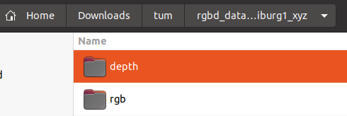
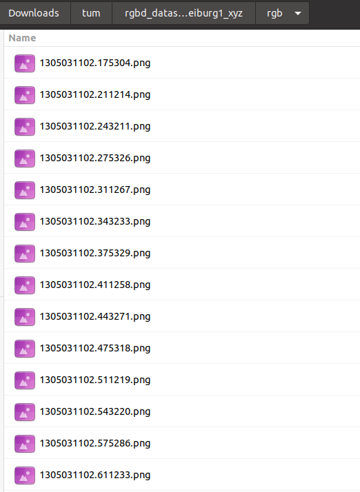
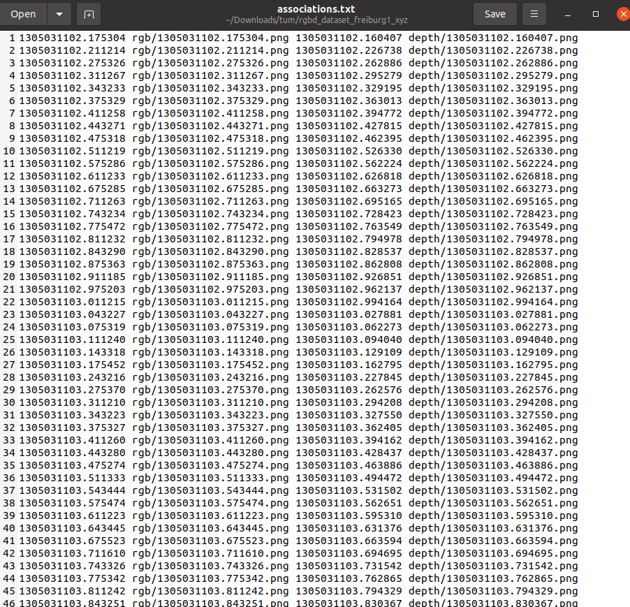
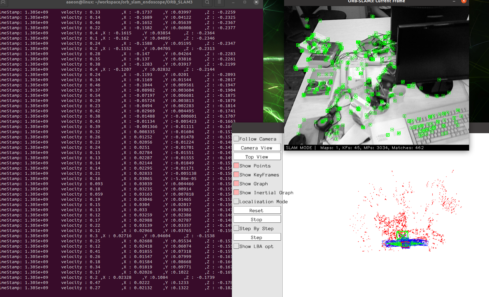

# orb_slam_endoscope


## Pangolin (visualization)

### PyUnicode_AsUTF8’ was not declared in this scope
https://blog.csdn.net/qq_40644435/article/details/120005868

```
# Get Pangolin
cd ~/your_fav_code_directory
git clone --recursive https://github.com/stevenlovegrove/Pangolin.git
cd Pangolin

# Install dependencies (as described above, or your preferred method)
./scripts/install_prerequisites.sh recommended

# Configure and build
cmake -DPYTHON_EXECUTABLE=/usr/bin/python3 --B build
cmake --build build

# GIVEME THE PYTHON STUFF!!!! (Check the output to verify selected python version)
cmake --build build -t pypangolin_pip_install

```

## openCV
```
sudo apt update
sudo apt-get install libpng-dev
sudo apt-get install libjpeg-dev
sudo apt-get install libopenexr-dev
sudo apt-get install libtiff-dev
sudo apt-get install libwebp-dev
sudo apt install libopencv-dev python3-opencv

git clone https://github.com/opencv/opencv.git
cd opencv/
git checkout 4.4.0
mkdir build
cd build/
cmake ..
make -j4
sudo make install
```

## DBow2
```
git clone https://github.com/dorian3d/DBoW2.git
cd DBoW2/
mkdir build
cd build/
cmake ..
sudo make install
```

## Eigen

```
git clone https://gitlab.com/libeigen/eigen.git
cd eigen-3.4.0/
mkdir build
cd build/
make
cmake ..
sudo make install
```

## Boot
```
mkdir boot
cd boot/
wget https://boostorg.jfrog.io/artifactory/main/release/1.80.0/source/boost_1_80_0.tar.bz2
tar --bzip2 -xf boost_1_80_0.tar.bz2
cd boost_1_80_0/
sudo ./bootstrap.sh
sudo ./b2
sudo ./b2 install
```

## ORB_SLAM3

### error: ‘std::chrono::monotonic_clock’ has not been declared
https://github.com/UZ-SLAMLab/ORB_SLAM3/issues/387#issuecomment-1073405877

```
sudo apt-get install libboost-dev
sudo apt install libssl-dev libopencv-dev libboost-filesystem-dev libboost-serialization-dev
cd ORB_SLAM3/
chmod +x build.sh
./build.sh 
```

## video to ORB SLAM3 data file format
you need change `videoToImg.py` 
video_path = '<video_path>.mp4'

```
mkdir output
python3 videoToImg.py
```

## Run ORB SLAM 3

./mono_tum <path_to_vocabulary> <path_to_settings> <path_to_sequence>
```
./Examples/Monocular/mono_tum Vocabulary/ORBvoc.txt ./Examples/Monocular/TUM1.yaml ../../Downloads/output
```

## Run ORB SLAM 3 (RGB-D)
- 生成associations.txt檔


利用associate_endoscopy.py讀取rgb與depth所在的資料夾，圖片檔案名稱是time stamps，也可以根據FPS自行生成time stamps，只要檔名是time stamps就好．

### Dataset Path內


### rgb 與 depth內


### 生成associations.txt檔案


參數
1. rgb資料夾位置
2. depth資料夾位置
3. 輸出位置

```bash
python3 evaluation/associate_endoscopy.py /home/aaeon/Downloads/tum/rgbd_dataset_freiburg1_xyz/rgb /home/aaeon/Downloads/tum/rgbd_dataset_freiburg1_xyz/depth > /home/aaeon/Downloads/tum/rgbd_dataset_freiburg1_xyz/associations.txt
```

### 執行RGB-D
參數
1. ORB路徑
2. rgb & depth資料根目錄
3. association.txt路徑
```
./Examples/RGB-D/rgbd_tum Vocabulary/ORBvoc.txt ./Examples/RGB-D/Endoscopy.yaml /home/aaeon/Downloads/tum/rgbd_dataset_freiburg1_xyz/ /home/aaeon/Downloads/tum/rgbd_dataset_freiburg1_xyz/associations.txt
```

### 執行結果
